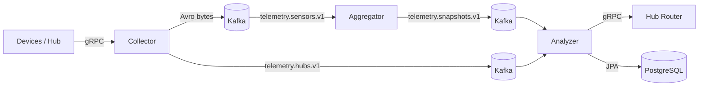

# Smart Home Tech (Telemetry + Commerce)
Учебный мульти-модульный проект «умного дома»: приём телеметрии по **gRPC**, доставка событий через **Kafka** (в формате **Avro**), агрегация состояния датчиков в «снапшоты» и выполнение сценариев автоматизации с отправкой действий в **Hub Router** по gRPC.

Проект собран как Maven **multi-module**. Основная функциональность находится в модуле `telemetry/*`.

В проекте два домена:

- `telemetry/*` — приём и обработка телеметрии умного дома (gRPC + Kafka/Avro + Postgres).
- `commerce/*` — базовые возможности интернет‑магазина (витрина товаров, корзина, склад).

В модуле `infra/*` — инфраструктурные сервисы Spring Cloud: **Config Server** (Externalized Configuration) и **Discovery Server (Eureka)**.


---

## Архитектура и поток данных

Система состоит из трёх сервисов и модуля контрактов (схем):

1) **Collector** — принимает события от устройств/хаба по gRPC и публикует их в Kafka.
2) **Aggregator** — читает сенсорные события из Kafka и собирает «снимок состояния» датчиков (snapshot) по каждому hub.
3) **Analyzer** — хранит конфигурацию датчиков и сценариев в Postgres, читает снапшоты и при выполнении условий отправляет действия в **Hub Router** по gRPC.
4) **Serialization** — общие контракты (Avro и Protobuf), из которых генерируются Java-классы.

### Общая схема



---

## Структура репозитория

```
.
├── compose.yaml
├── telemetry
│   ├── serialization
│   │   ├── avro-schemas          # *.avdl → Java (Avro)
│   │   └── proto-schemas         # *.proto → Java (gRPC/Protobuf)
│   ├── collector                 # gRPC server → Kafka (sensor/hub events)
│   ├── aggregator                # Kafka sensor events → snapshots
│   └── analyzer                  # scenarios + DB + gRPC client to Hub Router
├── infra
│   ├── config-server             # Spring Cloud Config Server
│   └── discovery-server          # Eureka Server
└── commerce
    ├── interaction-api           # DTO + Feign contracts
    ├── shopping-store            # витрина товаров
    ├── shopping-cart             # корзина покупателя
    └── warehouse                 # склад
```


---

## Технологии

- **Java 21**
- **Spring Boot 3.3.x**
- **gRPC** (через `net.devh:grpc-*-spring-boot-starter`)
- **Apache Kafka** (локально через Docker Compose)
- **Apache Avro** (без Schema Registry — бинарная сериализация `byte[]`)
- **PostgreSQL 15**
- **Maven** (multi-module)

---


## Spring Cloud (этапы 5–6)

В проект добавлены инфраструктурные сервисы:

- **Config Server** — централизованное хранение конфигураций (Externalized Configuration).  
  На этом этапе конфиги для `analyzer` и `collector` вынесены во внешний источник и подтягиваются при старте сервисов.
- **Discovery Server (Eureka)** — сервис‑реестр для обнаружения микросервисов.  
  Config Server регистрируется в Eureka, а остальные сервисы получают конфигурацию через discovery‑механизм (то есть могут стартовать без жёстко заданного URL Config Server).

Практическая подсказка: если сервис иногда стартует «через раз» с ошибкой чтения конфигурации — почти всегда это гонка старта.  
Решение: поднимать **Discovery Server → Config Server → остальные сервисы** (и/или включить retry/fail-fast настройки для Spring Cloud Config).

---

## Commerce: интернет‑магазин (этап 7)

Реализованы базовые микросервисы интернет‑магазина:

- **shopping-store** — витрина товаров (категории, состояние товара ACTIVE/DEACTIVATE, управление количеством через состояние ENDED/FEW/ENOUGH/MANY).
- **shopping-cart** — корзина пользователя (добавление/изменение позиций, деактивация корзины).
- **warehouse** — склад (учёт остатков и характеристик товара, проверка доступности для корзины, выдача адреса склада).

Технические особенности:

- **Database per Service** — каждый сервис работает только со своими данными в БД.
- Общие DTO и контракты вызовов вынесены в **interaction-api** (включая интерфейсы Feign‑клиентов).
- Взаимодействие сервисов — через **Feign** (REST). Для `shopping-cart → warehouse` добавлена проверка наличия товара на складе.
- Рекомендация для запуска: `server.port=0` (случайный порт) + регистрация в Eureka; Eureka — на порту **8761**.

---

## OpenAPI / Swagger спецификации

Спецификации API лежат рядом с репозиторием (JSON). Их удобно открывать в Swagger Editor / Swagger UI:

- [`http-api-spec.json`](./http-api-spec.json) — HTTP API (генерация/приём событий).
- [`shopping-store13012026.json`](./shopping-store13012026.json) — API сервиса **shopping-store** (`/api/v1/shopping-store/*`).
- [`shopping-cart-16062025.json`](./shopping-cart-16062025.json) — API сервиса **shopping-cart** (`/api/v1/shopping-cart/*`).
- [`warehouse-06022025.json`](./warehouse-06022025.json) — API сервиса **warehouse** (`/api/v1/warehouse/*`).

## Быстрый старт (локально)

### 1) Требования

- JDK 21
- Maven 3.9+
- Docker + Docker Compose
- (опционально) `grpcurl` для ручных gRPC-запросов

### 2) Поднять инфраструктуру (Kafka + Postgres)

В корне проекта:

```bash
docker compose up -d
```

Что поднимется:

- Kafka (порт **9092** наружу)
- Postgres (порт **5432** наружу)
- одноразовый контейнер `kafka-init-topics`, который создаст топики и завершится

Проверка (опционально):

```bash
docker compose ps
docker compose logs -f kafka
docker compose logs -f postgres
```

### 3) Собрать проект

Из корня репозитория:

```bash
mvn clean package
```

> В процессе сборки генерируются Java-классы из `*.avdl` и `*.proto` (модули `telemetry/serialization/*`).

### 4) Запустить сервисы

Рекомендуемый порядок:

1) **Discovery Server (Eureka)**
2) **Config Server**
3) **Collector**
4) **Aggregator**
5) **Analyzer**
6) **shopping-store**
7) **warehouse**
8) **shopping-cart**

#### Вариант A — через Maven:

```bash
mvn -pl infra/discovery-server spring-boot:run
mvn -pl infra/config-server    spring-boot:run

mvn -pl telemetry/collector    spring-boot:run
mvn -pl telemetry/aggregator   spring-boot:run
mvn -pl telemetry/analyzer     spring-boot:run

mvn -pl commerce/shopping-store spring-boot:run
mvn -pl commerce/warehouse      spring-boot:run
mvn -pl commerce/shopping-cart  spring-boot:run
```

#### Вариант B — через JAR (после `mvn package`):

```bash
java -jar telemetry/collector/target/collector-1.0-SNAPSHOT.jar
java -jar telemetry/aggregator/target/aggregator-1.0-SNAPSHOT.jar
java -jar telemetry/analyzer/target/analyzer-1.0-SNAPSHOT.jar
```

---

## Hub Router

`Analyzer` — **gRPC-клиент**. Он пытается отправлять действия в сервис **Hub Router** по адресу:

- `localhost:59090` (см. `telemetry/analyzer/src/main/resources/application.yaml`)

В этом репозитории Hub Router **не реализован** (контракт есть в proto-схемах).  
Если Hub Router не запущен — Analyzer всё равно может обрабатывать снапшоты, но при отправке действий будет логировать gRPC-ошибку.

---

## Конфигурация

> Примечание: после внедрения Spring Cloud Config (этап 5) и Eureka Discovery (этап 6) часть параметров может приезжать из **Config Server**.  
> Локальные `application.yaml` остаются как bootstrap/локальные дефолты, а «истина» для окружений хранится во внешней конфигурации.


### Collector

Файл: `telemetry/collector/src/main/resources/application.yaml`

- gRPC сервер: `grpc.server.port=59091`
- Kafka: `spring.kafka.bootstrap-servers=localhost:9092`
- Топики:
  - `collector.topics.sensors=telemetry.sensors.v1`
  - `collector.topics.hubs=telemetry.hubs.v1`

### Aggregator

Файл: `telemetry/aggregator/src/main/resources/application.yaml`

- Kafka: `spring.kafka.bootstrap-servers=localhost:9092`
- Топики:
  - `aggregator.topics.sensors=telemetry.sensors.v1`
  - `aggregator.topics.snapshots=telemetry.snapshots.v1`

### Analyzer

Файл: `telemetry/analyzer/src/main/resources/application.yaml`

- Kafka:
  - `analyzer.topics.hubs=telemetry.hubs.v1`
  - `analyzer.topics.snapshots=telemetry.snapshots.v1`
- Postgres:
  - `spring.datasource.url=jdbc:postgresql://localhost:5432/smarthome`
  - `spring.datasource.username=postgres`
  - `spring.datasource.password=postgres`
- Инициализация схемы:
  - `spring.sql.init.mode=always` (используется `schema.sql`)
- gRPC клиент Hub Router:
  - `grpc.client.hub-router.address=static://localhost:59090`
  - `grpc.client.hub-router.negotiation-type=plaintext`

---

## Kafka: топики и типы сообщений

Топики создаются контейнером `kafka-init-topics` из `compose.yaml`:

- `telemetry.sensors.v1` — сенсорные события (**SensorEventAvro**)
- `telemetry.hubs.v1` — события хаба (**HubEventAvro**)
- `telemetry.snapshots.v1` — агрегированные снапшоты (**SensorsSnapshotAvro**)

Формат value в Kafka: **Avro binary bytes**, без Schema Registry.  
То есть Producer сериализует в `byte[]`, Consumer использует собственные Avro-десериализаторы.

---

## Контракты и API

### 1) gRPC API Collector

Proto:  
`telemetry/serialization/proto-schemas/src/main/protobuf/telemetry/services/collector_controller.proto`

Сервис: `CollectorController`

Методы:

- `CollectSensorEvent(SensorEventProto) -> Empty`
- `CollectHubEvent(HubEventProto) -> Empty`

Collector включает gRPC reflection (`grpc.server.reflection-service-enabled=true`), поэтому удобно смотреть API через `grpcurl`.

Примеры:

```bash
grpcurl -plaintext localhost:59091 list
grpcurl -plaintext localhost:59091 describe telemetry.service.collector.CollectorController
```

Пример отправки Motion-события (в JSON используются lowerCamelCase имена полей):

```bash
grpcurl -plaintext \
  -d '{
    "id": "sensor-1",
    "hubId": "hub-1",
    "timestamp": {"seconds": 1735320000, "nanos": 0},
    "motionSensorEvent": {"linkQuality": 10, "motion": true, "voltage": 220}
  }' \
  localhost:59091 telemetry.service.collector.CollectorController/CollectSensorEvent
```

Пример добавления сценария (HubEvent → ScenarioAdded):

```bash
grpcurl -plaintext \
  -d '{
    "hubId": "hub-1",
    "timestamp": {"seconds": 1735320000, "nanos": 0},
    "scenarioAdded": {
      "name": "LightsOnWhenMotion",
      "condition": [
        {"sensorId": "sensor-motion-1", "type": "MOTION", "operation": "EQUALS", "boolValue": true}
      ],
      "action": [
        {"sensorId": "sensor-switch-1", "type": "ACTIVATE", "value": 1}
      ]
    }
  }' \
  localhost:59091 telemetry.service.collector.CollectorController/CollectHubEvent
```

> Подсказка: если сомневаешься в JSON-полях — используй `grpcurl ... describe ...` и reflection.

### 2) gRPC API Hub Router (контракт)

Proto:  
`telemetry/serialization/proto-schemas/src/main/protobuf/telemetry/services/hub_router_controller.proto`

Сервис: `HubRouterController`

- `handleDeviceAction(DeviceActionRequest) -> Empty`

`Analyzer` вызывает этот метод при выполнении сценария.

---

## База данных (Analyzer)

Файл схемы: `telemetry/analyzer/src/main/resources/schema.sql`

Таблицы:

- **sensors** — датчики, привязанные к hub (`hub_id`, `id`)
- **scenarios** — сценарии автоматизации (уникальны в рамках hub)
- **scenario_conditions** — условия сценариев
- **scenario_actions** — действия сценариев

Логика:

- Hub events (device/scenario added/removed) обновляют БД.
- Snapshot events проверяются на соответствие условиям.
- Если условия выполнены — отправляются действия в Hub Router.

---

## Разработка: генерация схем (Avro/Protobuf)

### Avro

Исходники: `telemetry/serialization/avro-schemas/src/main/avro/telemetry/*.avdl`

Генерация:

```bash
mvn -pl telemetry/serialization/avro-schemas generate-sources
```

### Protobuf / gRPC

Исходники: `telemetry/serialization/proto-schemas/src/main/protobuf/**/*.proto`

Генерация:

```bash
mvn -pl telemetry/serialization/proto-schemas generate-sources
```

---

## Полезные команды (Docker/Kafka)

Список топиков:

```bash
docker exec -it kafka kafka-topics --list --bootstrap-server kafka:29092
```

Почитать сообщения (значения будут бинарными из-за Avro, но можно проверить, что события вообще идут):

```bash
docker exec -it kafka kafka-console-consumer \
  --bootstrap-server kafka:29092 \
  --topic telemetry.sensors.v1 \
  --from-beginning \
  --property print.key=true
```

---

## Troubleshooting (частые проблемы)

### 1) Порты заняты

Используются:

- Kafka: `9092`
- Postgres: `5432`
- Collector gRPC: `59091`
- Hub Router gRPC (ожидается): `59090`

Если порт занят — поменяй в `compose.yaml` / `application.yaml` или освободи.

### 2) Analyzer не стартует (Postgres недоступен)

Analyzer требует Postgres на старте (инициализирует `schema.sql`). Проверь:

```bash
docker compose ps
docker compose logs -f postgres
```

### 3) В логах Analyzer ошибки gRPC на Hub Router

Это нормально, если Hub Router не запущен. Для полноценного end-to-end теста нужен внешний сервис на `localhost:59090` (или измените адрес в конфиге).
